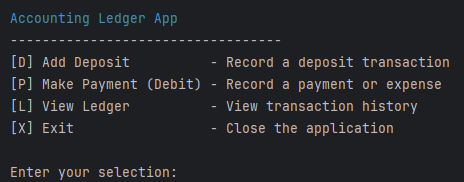
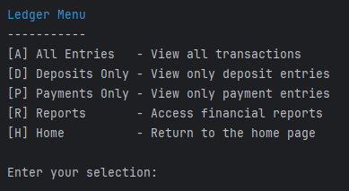
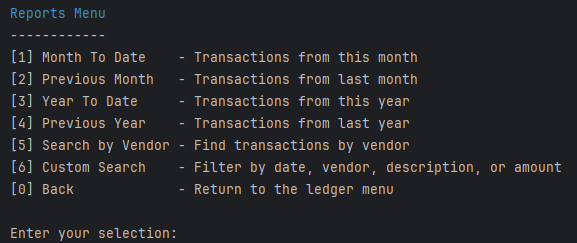
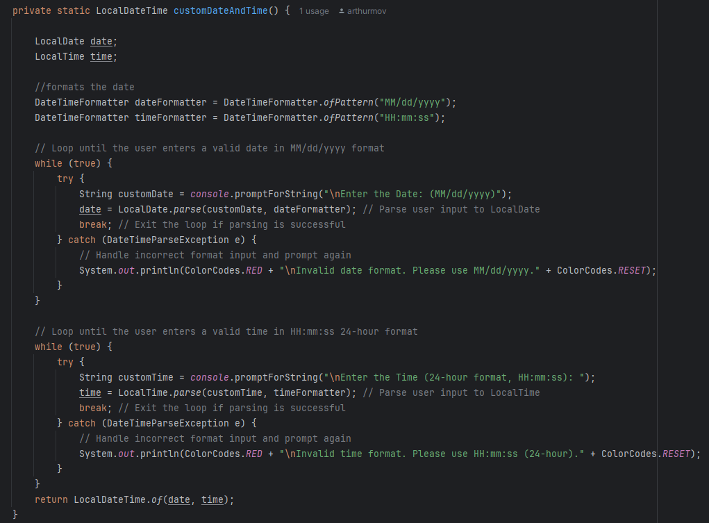

# Accounting Ledger App (Java CLI)

A user-friendly, console-based ledger system built with Java. This application allows you to track 
financial transactions (deposits and payments), view detailed logs, and generate insightful reports 
directly from the terminal.

---

## Features

- [x] Add deposits or payment entries with optional manual date/time
- [x] Store all transactions in `transactions.csv`
- [x] View your full ledger or filter by deposits, payments, or reports
- [x] Run reports like:
    - Month-To-Date
    - Previous Month
    - Year-To-Date
    - Previous Year
    - Vendor Search
    - Custom Search (date, vendor, description, amount)
- [x] Color-coded user feedback for success, errors, and prompts
- [x] Graceful handling of input errors, empty results, and user cancellations

---

### Home Menu


### Ledger Menu


### Reports Menu


### Interesting Piece of Code

One of the most time-consuming and educational pieces in this project was building a reusable 
customDateAndTime() method. This allows users to manually enter a custom date and time 
(in MM/dd/yyyy and 24-hour format), but it doesn't just assume the input is correct — it validates 
every field. I used two while loops and custom formatting logic to check input formats and give 
color-coded feedback. This took time to get right due to parsing errors, user edge cases, and making 
sure the app wouldn't crash. It taught me a lot about exception handling and robust user input flow in 
Java.

---

## File Structure

```bash
├── Main.java              # Entry point and main navigation
├── Transaction.java       # Data model for ledger entries
├── Ledger.java            # Handles reading/parsing transaction data
├── Report.java            # Implements all report screens and filters
├── Console.java           # Input/output utilities for prompts and formatting
├── ColorCodes.java        # ANSI color codes for console styling
└── transactions.csv       # Transaction history (created/updated by app)
